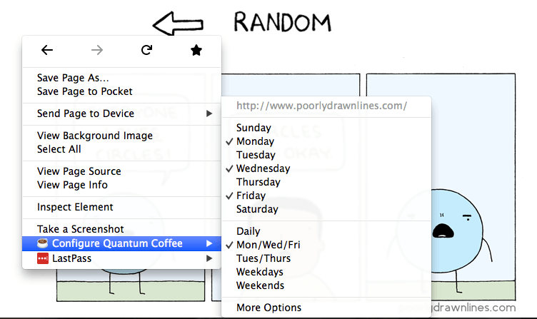
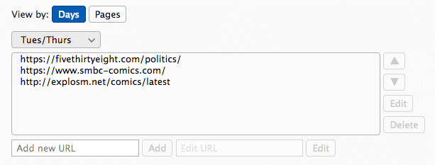
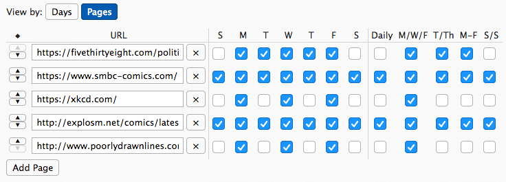

#  Quantum Coffee
Open your daily routine with just one click. Customize each day of the week to launch a different set of pages.

Whether it's the daily news or a weekly webcomic, Quantum Coffee lets you choose which sites you want to see, and when. Simply right click anywhere, or use the intuitive options page to add any webpage to your routine. To open your daily routine, simply click the toolbar button or use `Ctrl+Shift+C` as a convenient keyboard shortcut.

A modern update to the classic Morning Coffee add-on, Quantum Coffee makes it a breeze to manage your daily routine websites. [Add Quantum Coffee to your browser today.](https://addons.mozilla.org/en-US/firefox/addon/quantum-coffee/)

## Usage Instructions
### Managing Your Routine
There are multiple ways to add pages to your Quantum Coffee routine.

* Select or deselect days for an open page by right clicking anywhere on the page.

* Manage pages grouped by day in the extension preferences.

* Manage pages in an intuitive list in the extension preferences.

### Opening Your Routine
To open your routine for a day, all you need to do is click the Quantum Coffee button in your toolbar or menu, or you can use the convenient keyboard shortcut `Ctrl+Shift+C`.

## Additional Features
* Keep things fresh with the option to open pages in a random order every day!
* Sharing your routine has never been easier with the ability to import and export bookmarks.
* Only want to focus on your daily routine? Use the option to close your other tabs when you load your pages!

## Contributing
Found a bug or want a new feature added? Feel free to open an issue or make a pull request.

## License
Quantum Coffee is licensed under the terms of the [MIT License](https://opensource.org/licenses/MIT).
